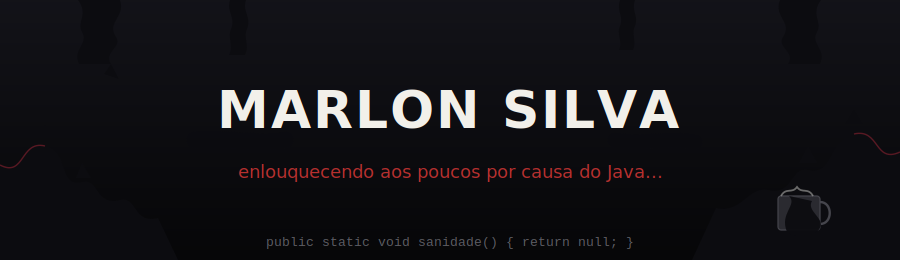

<svg width="100%" viewBox="0 0 690 230" role="img" style="" xmlns="http://www.w3.org/2000/svg">
<title style="fill:rgb(0, 0, 0);stroke:none;color:rgb(11, 11, 11);stroke-width:1px;stroke-linecap:butt;stroke-linejoin:miter;opacity:1;font-family:&quot;Anthropic Sans&quot;, -apple-system, BlinkMacSystemFont, &quot;Segoe UI&quot;, sans-serif;font-size:16px;font-weight:400;text-anchor:start;dominant-baseline:auto">Banner estilo simbionte devorando o texto, com piada sobre Java</title>
<desc style="fill:rgb(0, 0, 0);stroke:none;color:rgb(11, 11, 11);stroke-width:1px;stroke-linecap:butt;stroke-linejoin:miter;opacity:1;font-family:&quot;Anthropic Sans&quot;, -apple-system, BlinkMacSystemFont, &quot;Segoe UI&quot;, sans-serif;font-size:16px;font-weight:400;text-anchor:start;dominant-baseline:auto">Fundo preto com tentáculos escuros tipo goo rastejando das bordas, texto "MARLON SILVA" ao centro e legenda de piada sobre estar enlouquecendo por causa do Java, com uma xícara de café sendo engolida pelo goo</desc>
<defs>
<linearGradient id="goo" x1="0" y1="0" x2="0" y2="1">
<stop offset="0%" stop-color="#1a1a22"/>
<stop offset="100%" stop-color="#050506"/>
</linearGradient>
</defs>
<rect x="0" y="0" width="680" height="220" fill="#07070a" style="fill:rgb(7, 7, 10);stroke:none;color:rgb(11, 11, 11);stroke-width:1px;stroke-linecap:butt;stroke-linejoin:miter;opacity:1;font-family:&quot;Anthropic Sans&quot;, -apple-system, BlinkMacSystemFont, &quot;Segoe UI&quot;, sans-serif;font-size:16px;font-weight:400;text-anchor:start;dominant-baseline:auto"/>
<rect x="0" y="0" width="680" height="220" fill="url(#goo)" opacity="0.6" style="stroke:none;color:rgb(11, 11, 11);stroke-width:1px;stroke-linecap:butt;stroke-linejoin:miter;opacity:0.6;font-family:&quot;Anthropic Sans&quot;, -apple-system, BlinkMacSystemFont, &quot;Segoe UI&quot;, sans-serif;font-size:16px;font-weight:400;text-anchor:start;dominant-baseline:auto"/>

<path d="M0,220 L0,140 C20,150 15,120 35,125 C55,130 45,160 65,155 C80,152 75,175 95,170 C110,167 105,190 125,185 L140,220 Z" fill="#0c0c10" style="fill:rgb(12, 12, 16);stroke:none;color:rgb(11, 11, 11);stroke-width:1px;stroke-linecap:butt;stroke-linejoin:miter;opacity:1;font-family:&quot;Anthropic Sans&quot;, -apple-system, BlinkMacSystemFont, &quot;Segoe UI&quot;, sans-serif;font-size:16px;font-weight:400;text-anchor:start;dominant-baseline:auto"/>
<path d="M0,140 C20,150 15,120 35,125" stroke="#7a1f2b" stroke-width="1.2" fill="none" opacity="0.7" style="fill:none;stroke:rgb(122, 31, 43);color:rgb(11, 11, 11);stroke-width:1.2px;stroke-linecap:butt;stroke-linejoin:miter;opacity:0.7;font-family:&quot;Anthropic Sans&quot;, -apple-system, BlinkMacSystemFont, &quot;Segoe UI&quot;, sans-serif;font-size:16px;font-weight:400;text-anchor:start;dominant-baseline:auto"/>
<circle cx="35" cy="125" r="3" fill="#0c0c10" style="fill:rgb(12, 12, 16);stroke:none;color:rgb(11, 11, 11);stroke-width:1px;stroke-linecap:butt;stroke-linejoin:miter;opacity:1;font-family:&quot;Anthropic Sans&quot;, -apple-system, BlinkMacSystemFont, &quot;Segoe UI&quot;, sans-serif;font-size:16px;font-weight:400;text-anchor:start;dominant-baseline:auto"/>
<path d="M28,118 L35,108 L42,118 Z" fill="#0c0c10" style="fill:rgb(12, 12, 16);stroke:none;color:rgb(11, 11, 11);stroke-width:1px;stroke-linecap:butt;stroke-linejoin:miter;opacity:1;font-family:&quot;Anthropic Sans&quot;, -apple-system, BlinkMacSystemFont, &quot;Segoe UI&quot;, sans-serif;font-size:16px;font-weight:400;text-anchor:start;dominant-baseline:auto"/>
<path d="M60,150 L65,138 L72,150 Z" fill="#0c0c10" style="fill:rgb(12, 12, 16);stroke:none;color:rgb(11, 11, 11);stroke-width:1px;stroke-linecap:butt;stroke-linejoin:miter;opacity:1;font-family:&quot;Anthropic Sans&quot;, -apple-system, BlinkMacSystemFont, &quot;Segoe UI&quot;, sans-serif;font-size:16px;font-weight:400;text-anchor:start;dominant-baseline:auto"/>

<path d="M680,220 L680,130 C660,140 665,110 645,115 C625,120 630,150 610,145 C595,142 598,168 578,163 C560,159 555,185 535,180 L520,220 Z" fill="#0c0c10" style="fill:rgb(12, 12, 16);stroke:none;color:rgb(11, 11, 11);stroke-width:1px;stroke-linecap:butt;stroke-linejoin:miter;opacity:1;font-family:&quot;Anthropic Sans&quot;, -apple-system, BlinkMacSystemFont, &quot;Segoe UI&quot;, sans-serif;font-size:16px;font-weight:400;text-anchor:start;dominant-baseline:auto"/>
<path d="M680,130 C660,140 665,110 645,115" stroke="#7a1f2b" stroke-width="1.2" fill="none" opacity="0.7" style="fill:none;stroke:rgb(122, 31, 43);color:rgb(11, 11, 11);stroke-width:1.2px;stroke-linecap:butt;stroke-linejoin:miter;opacity:0.7;font-family:&quot;Anthropic Sans&quot;, -apple-system, BlinkMacSystemFont, &quot;Segoe UI&quot;, sans-serif;font-size:16px;font-weight:400;text-anchor:start;dominant-baseline:auto"/>
<path d="M638,108 L645,96 L652,108 Z" fill="#0c0c10" style="fill:rgb(12, 12, 16);stroke:none;color:rgb(11, 11, 11);stroke-width:1px;stroke-linecap:butt;stroke-linejoin:miter;opacity:1;font-family:&quot;Anthropic Sans&quot;, -apple-system, BlinkMacSystemFont, &quot;Segoe UI&quot;, sans-serif;font-size:16px;font-weight:400;text-anchor:start;dominant-baseline:auto"/>
<path d="M603,138 L610,124 L617,138 Z" fill="#0c0c10" style="fill:rgb(12, 12, 16);stroke:none;color:rgb(11, 11, 11);stroke-width:1px;stroke-linecap:butt;stroke-linejoin:miter;opacity:1;font-family:&quot;Anthropic Sans&quot;, -apple-system, BlinkMacSystemFont, &quot;Segoe UI&quot;, sans-serif;font-size:16px;font-weight:400;text-anchor:start;dominant-baseline:auto"/>

<path d="M0,0 L90,0 C95,14 80,18 88,30 C93,38 78,42 84,52 L60,52 C55,40 68,36 62,26 C58,18 68,12 60,0 Z" fill="#0c0c10" style="fill:rgb(12, 12, 16);stroke:none;color:rgb(11, 11, 11);stroke-width:1px;stroke-linecap:butt;stroke-linejoin:miter;opacity:1;font-family:&quot;Anthropic Sans&quot;, -apple-system, BlinkMacSystemFont, &quot;Segoe UI&quot;, sans-serif;font-size:16px;font-weight:400;text-anchor:start;dominant-baseline:auto"/>
<path d="M84,52 L90,64 L78,60 Z" fill="#0c0c10" style="fill:rgb(12, 12, 16);stroke:none;color:rgb(11, 11, 11);stroke-width:1px;stroke-linecap:butt;stroke-linejoin:miter;opacity:1;font-family:&quot;Anthropic Sans&quot;, -apple-system, BlinkMacSystemFont, &quot;Segoe UI&quot;, sans-serif;font-size:16px;font-weight:400;text-anchor:start;dominant-baseline:auto"/>

<path d="M680,0 L590,0 C585,14 600,18 592,30 C587,38 602,42 596,52 L620,52 C625,40 612,36 618,26 C622,18 612,12 620,0 Z" fill="#0c0c10" style="fill:rgb(12, 12, 16);stroke:none;color:rgb(11, 11, 11);stroke-width:1px;stroke-linecap:butt;stroke-linejoin:miter;opacity:1;font-family:&quot;Anthropic Sans&quot;, -apple-system, BlinkMacSystemFont, &quot;Segoe UI&quot;, sans-serif;font-size:16px;font-weight:400;text-anchor:start;dominant-baseline:auto"/>

<path d="M175,0 C172,10 180,14 176,24 C173,32 179,38 175,46 L188,46 C192,38 186,32 189,24 C193,14 185,10 188,0 Z" fill="#0c0c10" style="fill:rgb(12, 12, 16);stroke:none;color:rgb(11, 11, 11);stroke-width:1px;stroke-linecap:butt;stroke-linejoin:miter;opacity:1;font-family:&quot;Anthropic Sans&quot;, -apple-system, BlinkMacSystemFont, &quot;Segoe UI&quot;, sans-serif;font-size:16px;font-weight:400;text-anchor:start;dominant-baseline:auto"/>
<path d="M470,0 C467,9 474,13 471,22 C468,29 473,35 470,42 L481,42 C484,35 479,29 482,22 C485,13 478,9 481,0 Z" fill="#0c0c10" style="fill:rgb(12, 12, 16);stroke:none;color:rgb(11, 11, 11);stroke-width:1px;stroke-linecap:butt;stroke-linejoin:miter;opacity:1;font-family:&quot;Anthropic Sans&quot;, -apple-system, BlinkMacSystemFont, &quot;Segoe UI&quot;, sans-serif;font-size:16px;font-weight:400;text-anchor:start;dominant-baseline:auto"/>

<text x="340" y="108" text-anchor="middle" font-size="42" font-weight="500" fill="#f2f0ea" font-family="var(--font-sans)" letter-spacing="2" style="fill:rgb(11, 11, 11);stroke:none;color:rgb(11, 11, 11);stroke-width:1px;stroke-linecap:butt;stroke-linejoin:miter;opacity:1;font-family:&quot;Anthropic Sans&quot;, sans-serif;font-size:14px;font-weight:500;text-anchor:middle;dominant-baseline:auto">MARLON SILVA</text>

<path d="M150,118 C170,116 190,122 210,118" stroke="#0c0c10" stroke-width="14" fill="none" stroke-linecap="round" opacity="0.9" style="fill:none;stroke:rgb(12, 12, 16);color:rgb(11, 11, 11);stroke-width:14px;stroke-linecap:round;stroke-linejoin:miter;opacity:0.9;font-family:&quot;Anthropic Sans&quot;, -apple-system, BlinkMacSystemFont, &quot;Segoe UI&quot;, sans-serif;font-size:16px;font-weight:400;text-anchor:start;dominant-baseline:auto"/>
<path d="M470,118 C490,122 505,116 525,120" stroke="#0c0c10" stroke-width="12" fill="none" stroke-linecap="round" opacity="0.9" style="fill:none;stroke:rgb(12, 12, 16);color:rgb(11, 11, 11);stroke-width:12px;stroke-linecap:round;stroke-linejoin:miter;opacity:0.9;font-family:&quot;Anthropic Sans&quot;, -apple-system, BlinkMacSystemFont, &quot;Segoe UI&quot;, sans-serif;font-size:16px;font-weight:400;text-anchor:start;dominant-baseline:auto"/>

<text x="340" y="150" text-anchor="middle" font-size="15" fill="#b8302f" font-family="var(--font-sans)" font-style="italic" style="fill:rgb(82, 81, 78);stroke:none;color:rgb(11, 11, 11);stroke-width:1px;stroke-linecap:butt;stroke-linejoin:miter;opacity:1;font-family:&quot;Anthropic Sans&quot;, sans-serif;font-size:12px;font-weight:400;font-style:italic;text-anchor:middle;dominant-baseline:auto">enlouquecendo aos poucos por causa do Java...</text>

<g style="fill:rgb(0, 0, 0);stroke:none;color:rgb(11, 11, 11);stroke-width:1px;stroke-linecap:butt;stroke-linejoin:miter;opacity:1;font-family:&quot;Anthropic Sans&quot;, -apple-system, BlinkMacSystemFont, &quot;Segoe UI&quot;, sans-serif;font-size:16px;font-weight:400;text-anchor:start;dominant-baseline:auto">
<rect x="590" y="165" width="34" height="28" rx="3" fill="#2a2a30" stroke="#45454c" stroke-width="1" style="fill:rgb(42, 42, 48);stroke:rgb(69, 69, 76);color:rgb(11, 11, 11);stroke-width:1px;stroke-linecap:butt;stroke-linejoin:miter;opacity:1;font-family:&quot;Anthropic Sans&quot;, -apple-system, BlinkMacSystemFont, &quot;Segoe UI&quot;, sans-serif;font-size:16px;font-weight:400;text-anchor:start;dominant-baseline:auto"/>
<path d="M624,170 C634,170 634,188 624,188" stroke="#45454c" stroke-width="2" fill="none" style="fill:none;stroke:rgb(69, 69, 76);color:rgb(11, 11, 11);stroke-width:2px;stroke-linecap:butt;stroke-linejoin:miter;opacity:1;font-family:&quot;Anthropic Sans&quot;, -apple-system, BlinkMacSystemFont, &quot;Segoe UI&quot;, sans-serif;font-size:16px;font-weight:400;text-anchor:start;dominant-baseline:auto"/>
<path d="M592,165 C596,158 600,164 604,158 C608,164 612,158 616,165" stroke="#c9c9c4" stroke-width="1.5" fill="none" opacity="0.5" style="fill:none;stroke:rgb(201, 201, 196);color:rgb(11, 11, 11);stroke-width:1.5px;stroke-linecap:butt;stroke-linejoin:miter;opacity:0.5;font-family:&quot;Anthropic Sans&quot;, -apple-system, BlinkMacSystemFont, &quot;Segoe UI&quot;, sans-serif;font-size:16px;font-weight:400;text-anchor:start;dominant-baseline:auto"/>
<path d="M598,165 C605,172 590,178 596,193 C600,198 618,198 622,190 C626,182 610,176 615,168 Z" fill="#0c0c10" opacity="0.95" style="fill:rgb(12, 12, 16);stroke:none;color:rgb(11, 11, 11);stroke-width:1px;stroke-linecap:butt;stroke-linejoin:miter;opacity:0.95;font-family:&quot;Anthropic Sans&quot;, -apple-system, BlinkMacSystemFont, &quot;Segoe UI&quot;, sans-serif;font-size:16px;font-weight:400;text-anchor:start;dominant-baseline:auto"/>
</g>

<text x="340" y="205" text-anchor="middle" font-size="11" fill="#5c5c62" font-family="var(--font-sans)" style="fill:rgb(82, 81, 78);stroke:none;color:rgb(11, 11, 11);stroke-width:1px;stroke-linecap:butt;stroke-linejoin:miter;opacity:1;font-family:&quot;Anthropic Sans&quot;, sans-serif;font-size:12px;font-weight:400;text-anchor:middle;dominant-baseline:auto">public static void sanidade() { return null; }</text>
</svg>
